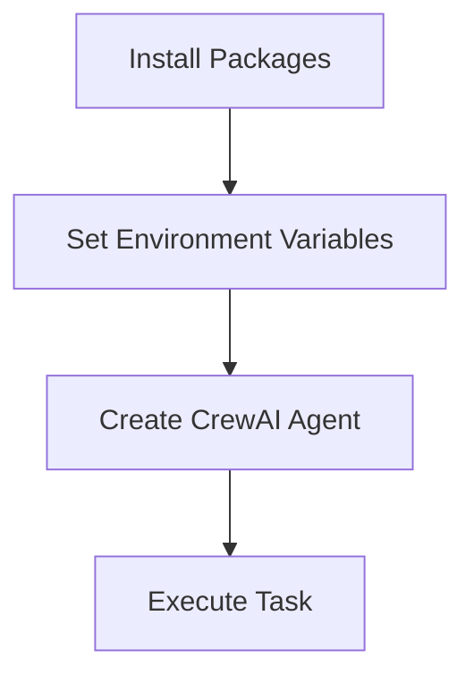
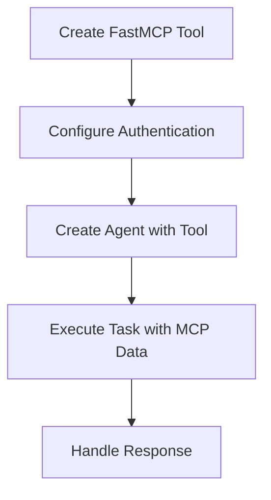
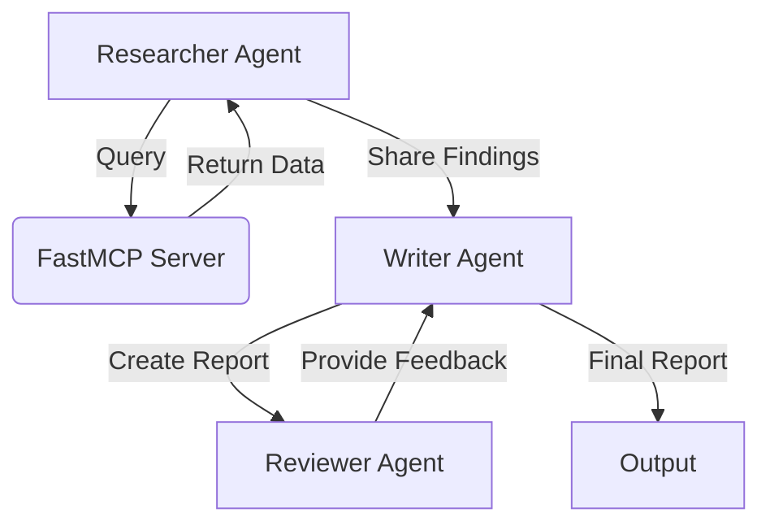

# CrewAI with FastMCP Server Integration Course

This course teaches beginners how to use CrewAI with FastMCP server access through step-by-step programming examples.

## Course Overview

This course is designed for beginner developers with basic Python knowledge who want to learn how to integrate CrewAI agents with FastMCP servers. The course covers fundamental concepts, practical implementation, and advanced patterns for building intelligent agent workflows.

## Lessons

### Lesson 1: Setting up CrewAI with MCP Server Access
- Install required packages
- Set up environment variables
- Create a basic CrewAI agent
- Execute simple tasks



### Lesson 2: Integrating MCP Server with CrewAI
- Create custom tools for MCP server access
- Configure authentication and connection settings
- Use MCP server data in agent tasks
- Handle errors and exceptions



### Lesson 3: Advanced CrewAI Patterns with MCP Server
- Implement multi-agent workflows
- Use hierarchical processes
- Share data between agents through the MCP server
- Store and retrieve research findings
- Implement quality assurance processes



## Try it without a real server (mock FastMCP)

You don't need to deploy a real FastMCP server to run Lessons 2 and 3. This repo
ships a zero-dependency mock server, `mock_fastmcp_server.py`, that implements
the `POST /query` and `POST /store` endpoints the lessons use.

In one terminal, start the mock server:
```bash
python mock_fastmcp_server.py            # serves http://127.0.0.1:8000, api key "test-key"
```

In another terminal, point the lessons at it and run them:
```bash
export FASTMCP_URL=http://127.0.0.1:8000
export FASTMCP_API_KEY=test-key
export OPENAI_API_KEY=sk-...              # still needed: the agents are driven by an LLM
python lesson2_mcp_integration.py
```

The mock keeps stored findings in memory (they reset when it stops) and returns
clearly-labelled `[mock data]` answers, so it's obvious which content came from
the server versus the LLM. It also exposes `GET /health` and `GET /fetch?key=`
for quick manual testing with `curl`.

## Run the offline test (no API key needed)

To verify the FastMCP integration end-to-end without an LLM key or even CrewAI
installed, run the offline test. It starts the mock server in-process and
exercises the shared client (`fastmcp_client.py`) — the same code the lesson
tools use — covering the happy paths and the error handling (bad auth,
unreachable server):

```bash
pip install requests          # the only dependency the test needs
python test_offline.py
```

Expected output ends with `All checks PASSED` (exit code 0). This is safe to run
in CI with no secrets configured. The lesson tools delegate their HTTP logic to
`fastmcp_client.py`, so a green test means the data-plane the agents rely on
works; only the LLM-driven orchestration itself still needs `OPENAI_API_KEY`.

## Getting Started

### Using pip (traditional method)

1. Install the required packages:
```bash
pip install -r requirements.txt
```

2. Set up your environment variables:
```bash
export FASTMCP_URL=http://your-fastmcp-server-url:port
export FASTMCP_API_KEY=your-api-key
```

3. Run the examples:
```bash
python lesson1_setup.py
python lesson2_mcp_integration.py
python lesson3_advanced_patterns.py
```

### Using uv (recommended modern method)

[uv](https://github.com/astral-sh/uv) is a fast Python package installer and resolver. To use uv:

1. Install uv:
```bash
pip install uv
```

2. Create and activate a virtual environment:
```bash
uv venv
source .venv/Scripts/activate
```

3. Install dependencies:
```bash
uv pip install -r requirements.txt
```

4. Set up your environment variables:
```bash
export FASTMCP_URL=http://your-fastmcp-server-url:port
export FASTMCP_API_KEY=your-api-key
```

5. Run the examples:
```bash
python lesson1_setup.py
python lesson2_mcp_integration.py
python lesson3_advanced_patterns.py
```

## Requirements

- Python 3.8+
- CrewAI library
- FastMCP library
- Access to an MCP server

## Course Structure

Each lesson includes:
- A Python script with comprehensive comments
- Clear objectives and expected outcomes
- Step-by-step implementation
- Best practices for error handling and security

## Next Steps

After completing this course, you should be able to:
- Create and configure CrewAI agents
- Integrate MCP servers with agent workflows
- Build complex multi-agent systems
- Implement data sharing between agents
- Design robust error handling for production systems